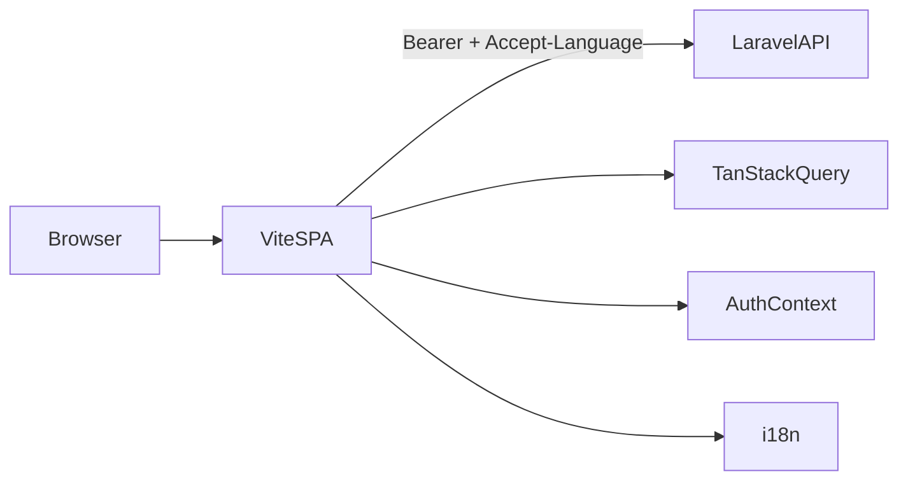
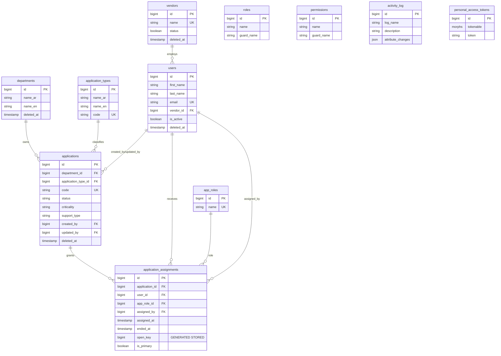

# Enterprise IT Portfolio & Access Management System — Project Implementation Status

**Document type:** Technical handover  
**Audience:** Senior developers and AI coding assistants continuing work on this repository  
**Generated from:** Current source code under `backend/` and `frontend/`  
**Implementation baseline:** Sprints 2–17 complete (schema through QA)  
**Authoritative framework version:** **Laravel 13** (ignore stale “Laravel 12” references in older docs / `.cursorrules`)

---

# 1. Project Overview

## Project name

**Enterprise IT Portfolio & Access Management System** (workspace: `it-portfolio-system`)

## Business purpose

A centralized enterprise registry for:

- **IT applications** (portfolio inventory)
- **Departments** (organizational owners of applications)
- **Vendors** (external partner companies)
- **Users** (employees and contractor accounts, optionally linked to vendors)
- **Application assignments** (historically tracked access matrix: which user has which **app role** on which application, with start/end audit fields)

The system’s differentiating capability is **assignment history**: access is not a mutable pivot. Re-assigning a user to the same application **closes** the open row and **inserts** a new row.

## Main goals

| Goal | How V1 addresses it |
| --- | --- |
| Asset visibility | Applications CRUD with type, department, status, criticality, support type, owners, URLs |
| Access governance | Assignments with `assigned_by`, `assigned_at`, `ended_at`, `app_role_id`, `is_primary`, `remarks` |
| Vendor tracking | Vendors CRUD + optional `users.vendor_id` |
| Security & RBAC | Sanctum bearer tokens + Spatie roles `super_admin` / `employee` |
| Bilingual UX | Backend `en`/`ar` messages + frontend `react-i18next` with RTL |

## Target users

| Role (Spatie) | Typical use |
| --- | --- |
| `super_admin` | Full CRUD on applications, vendors, departments, users, assignments |
| `employee` | Read/list applications, vendors, departments, users, assignments |

UI gates create/edit/delete actions with `isSuperAdmin`. API policies enforce the same role rules server-side.

## Current implementation status

**V1 core is implemented and test-covered for assignment history and index eager-loading.**

| Area | Status |
| --- | --- |
| Backend domain schema + models | Done |
| Services, policies, form requests, resources, `/api/v1` routes | Done |
| Seeders + Super Admin bootstrap | Done |
| Frontend SPA shell + auth + CRUD features | Done |
| Assignments matrix UI | Done |
| i18n EN/AR + RTL | Done |
| Feature/unit tests (assignments + N+1 bounds) | Done |
| Excel export, SSO, activity-log UI, servers/licenses/etc. | **Not in V1** |

Default admin (overridable via env):

- Email: `admin@itportfolio.local`
- Password: `password`
- Env keys: `SUPER_ADMIN_EMAIL`, `SUPER_ADMIN_PASSWORD`

---

# 2. Technology Stack

## Backend

| Technology | Version (constraint / locked) | Why selected |
| --- | --- | --- |
| PHP | `^8.3` | Typed enterprise backend; required by Laravel 13 |
| Laravel | `^13.8` / locked **13.19.0** | API-first framework; Eloquent; migrations; Form Requests; Policies |
| MySQL | Production DB (`.env` `DB_CONNECTION=mysql`) | Supports **STORED generated columns** used by `open_key` uniqueness |
| Laravel Sanctum | `^4.3` / **4.3.2** | Stateless SPA Bearer token auth |
| Spatie Permission | `^8.3` / **8.3.0** | Roles/permissions tables; `HasRoles` on User |
| Spatie Activitylog | `^5.0` / **5.0.0** | Audit trail on Vendor, Application, ApplicationAssignment |
| Maatwebsite Excel | `^3.1` / **3.1.69** | Installed for future exports; **not used in app code yet** |
| PHPUnit | `^12.5` | Feature/unit tests (SQLite in-memory in `phpunit.xml`) |
| Laravel Pint | `^1.27` | PHP style (CI expectation) |

**Test note:** PHPUnit forces `DB_CONNECTION=sqlite` + `:memory:`. Production-unique `open_key` generated column also migrates under SQLite in current Laravel.

## Frontend

| Technology | Version | Why selected |
| --- | --- | --- |
| React | `^19.2.7` | Component SPA; concurrent features |
| TypeScript | `~6.0.2` | End-to-end typed contracts with API resources |
| Vite | `^8.1.1` | Fast HMR; React plugin; Tailwind Vite plugin |
| Tailwind CSS | `^4.3.2` | Utility CSS; **v4 `@theme` in CSS** (no classic `tailwind.config.ts`) |
| `@tailwindcss/vite` | `^4.3.2` | Tailwind pipeline |
| shadcn/ui (`shadcn` pkg) | `^4.13.0` | Accessible form/dialog/table primitives |
| Radix UI | `radix-ui@^1.6.2` | Headless primitives under shadcn wrappers |
| Lucide React | `^1.24.0` | Icon set |
| TanStack Query | `^5.101.2` | Server-state cache, pagination, mutations |
| React Router DOM | `^7.18.1` | Client routing + protected/guest routes |
| Axios | `^1.18.1` | HTTP client + interceptors |
| React Hook Form | `^7.81.0` | Form state |
| Zod | `^4.4.3` | Client validation (localized factories) |
| `@hookform/resolvers` | `^5.4.0` | Zod ↔ RHF |
| Sonner | `^2.0.7` | Toasts |
| i18next / react-i18next | `^26.3.6` / `^17.0.9` | EN/AR UI |
| Geist + Noto Sans Arabic (fontsource) | variable packs | LTR Latin + Arabic glyphs |
| cmdk | `^1.1.1` | Combobox command palette |
| Oxlint | `^1.71.0` | Lint (`npm run lint`); **not ESLint** |

## Development tools

| Tool | Role |
| --- | --- |
| npm | Frontend package manager |
| Composer | Backend package manager |
| Git | VCS (Conventional Commits expected) |
| Vite proxy `/api` → `http://127.0.0.1:8000` | Local SPA ↔ Laravel without CORS friction |
| PostCSS / Autoprefixer | Present as deps; Tailwind primarily via Vite plugin |
| `.cursorrules` | Architecture rules for AI/human contributors |

---

# 3. Project Structure

```
it-portfolio-system/
├── .cursorrules                 # AI/human coding standards (layered Laravel + feature React)
├── docs/                        # Product & architecture docs (including this file)
├── backend/                     # Laravel 13 API
│   ├── app/
│   │   ├── Enums/
│   │   ├── Exceptions/          # DomainException
│   │   ├── Http/
│   │   │   ├── Controllers/Api/V1/
│   │   │   ├── Middleware/      # SetLocaleFromHeader
│   │   │   ├── Requests/
│   │   │   └── Resources/
│   │   ├── Models/
│   │   ├── Policies/
│   │   ├── Providers/           # Gate policies, Model::preventLazyLoading
│   │   └── Services/            # Business logic (no HTTP)
│   ├── bootstrap/app.php        # API exception envelope, middleware
│   ├── database/migrations/
│   ├── database/factories/
│   ├── database/seeders/
│   ├── lang/en|ar/messages.php
│   ├── routes/api.php
│   └── tests/
└── frontend/                    # React 19 + Vite SPA
    ├── src/
    │   ├── app/providers.tsx    # QueryClientProvider
    │   ├── components/          # Shared + ui/*
    │   ├── features/            # Feature modules (required architecture)
    │   ├── hooks/
    │   ├── layouts/
    │   ├── lib/                 # axios, i18n, auth-storage, lookups
    │   ├── locales/             # en.json, ar.json
    │   ├── routes/AppRouter.tsx
    │   ├── types/api.ts
    │   └── utils/format.ts
    ├── vite.config.ts
    └── components.json          # shadcn metadata
```

## Folder responsibilities

| Path | Responsibility |
| --- | --- |
| `backend/app/Services` | All business workflows, transactions, assignment history |
| `backend/app/Http/Controllers/Api/V1` | Thin: authorize → service → Resource/envelope |
| `backend/app/Http/Requests` | Validation + `authorize()` via policies |
| `backend/app/Http/Resources` | JSON shaping; `whenLoaded` for relations |
| `backend/app/Policies` | Role-based authorization |
| `frontend/src/features/<name>/` | Page + dialog + hooks + service + types for one domain |
| `frontend/src/components/ui` | shadcn primitives |
| `frontend/src/layouts` | TailAdmin-inspired shell (sidebar/header) |
| `frontend/src/lib` | Cross-cutting infrastructure |

**Do not** introduce a Repository layer. Eloquent + Services is the standard.

---

# 4. Frontend Architecture

## High-level flow



## Routing

- Declared in `src/routes/AppRouter.tsx`
- `BrowserRouter` under `AppProviders` → `AuthProvider`
- Nested layout route: `ProtectedRoute` → `DefaultLayout` → feature pages
- Unknown paths: `<Navigate to="/404" />`

## Authentication flow

1. Login posts credentials via `authService`
2. Token + user stored in `localStorage` (`it_portfolio_token`, `it_portfolio_user`)
3. Axios attaches `Authorization: Bearer …`
4. Bootstrap: if token present, `GET /auth/me`; on failure clear storage
5. `401` interceptor clears storage and hard-redirects to `/login`

## Component structure

- **Feature pages** own list UX (search/sort/pagination) and open dialogs
- **Form dialogs** own RHF + Zod + mutation
- **Hooks** wrap TanStack Query; toast via Sonner + i18n
- **Components must not call Axios directly**

## Shared components

`EmptyState`, `LoadingSkeleton`, `ErrorBoundary`, `LanguageSwitcher`, `error-pages`, plus `components/ui/*`

## UI library

Hybrid:

- **TailAdmin-inspired** chrome in layouts (`--brand`, `--body`, `--stroke`, sidebar)
- **shadcn/ui** for interactive primitives

## State management

| Concern | Mechanism |
| --- | --- |
| Server data | TanStack Query only (**no Redux**) |
| Auth | React Context + localStorage |
| Sidebar | React Context |
| Forms / dialogs / filters | Local `useState` / RHF |

Query defaults (`app/providers.tsx`): `staleTime 30s`, `retry 1`, `refetchOnWindowFocus false`, mutations `retry 0`.

## API layer

- Central instance: `src/lib/axios.ts`
- Base URL: `VITE_API_BASE_URL` or `/api/v1`
- Feature `*-service.ts` maps to REST resources
- Shared helpers: `getApiErrorMessage`, `getApiFieldErrors`

## Error handling

| Layer | Behavior |
| --- | --- |
| Axios 401 | Clear auth + redirect login |
| Mutation errors | Sonner toast + optional field errors into RHF |
| Render crashes | `ErrorBoundary` (app + layout outlet) |
| HTTP error pages | `/403`, `/404`, `/500` routes |

## Theme / Tailwind

- Tailwind **v4 CSS-first**: tokens in `src/index.css` via `@theme inline`
- Fonts: Geist + Noto Sans Arabic
- Dark CSS variables exist; **no dark-mode toggle wired**
- Prefer logical properties (`ms-`, `ps-`, `start-`, `text-end`) for RTL

## shadcn configuration

- `components.json` present; components manually under `components/ui`
- Combobox composed from Command + Popover

---

# 5. Pages

## Implemented pages

### Login

| Field | Detail |
| --- | --- |
| **Purpose** | Authenticate and obtain Sanctum token |
| **URL** | `/login` |
| **Layout** | Standalone (no sidebar); LanguageSwitcher top-end |
| **Components** | RHF form, shadcn Input/Button, LanguageSwitcher |
| **API** | `POST /api/v1/auth/login` |
| **Validation** | Zod email/password; backend 422 mapped to fields |
| **Permissions** | Guest only (`GuestRoute`) |
| **UX** | Dev defaults prefilled; redirect to `state.from` or `/` |
| **Future** | Remove hardcoded credentials; localize auth toasts |

### Dashboard

| Field | Detail |
| --- | --- |
| **Purpose** | Landing overview + quick links |
| **URL** | `/` |
| **Layout** | DefaultLayout |
| **Components** | Welcome card, quick links, EmptyState |
| **API** | None (auth user from context) |
| **Permissions** | Authenticated |
| **Future** | Real assignment activity feed / KPIs |

### Applications

| Field | Detail |
| --- | --- |
| **Purpose** | IT application inventory CRUD |
| **URL** | `/applications` |
| **Components** | `ApplicationsPage`, `ApplicationFormDialog` |
| **API** | `GET/POST/PUT/DELETE /applications`; lookups for departments & types |
| **Logic** | Debounced search, sort, pagination; soft-delete confirm |
| **Validation** | `createApplicationFormSchema(t)` |
| **Permissions** | View all auth users; mutate if `super_admin` |
| **Future** | Detail page; restore; Excel export |

### Vendors

| Field | Detail |
| --- | --- |
| **URL** | `/vendors` |
| **API** | `/vendors` CRUD |
| **Permissions** | Same super_admin write gate |
| **Future** | Vendor↔user matrix view |

### Departments

| Field | Detail |
| --- | --- |
| **URL** | `/departments` |
| **API** | `/departments` CRUD |
| **Notes** | Bilingual `name_en` / `name_ar` |
| **Future** | Soft-delete restore UI |

### Users

| Field | Detail |
| --- | --- |
| **URL** | `/users` |
| **Components** | Form with vendor Combobox; create vs update password schemas |
| **API** | `/users` CRUD |
| **Logic** | Inline `is_active` toggle via update mutation |
| **Permissions** | Super admin writes |
| **Future** | Assign Spatie roles from UI (API lacking today) |

### Assignments (core)

| Field | Detail |
| --- | --- |
| **Purpose** | Historical access matrix |
| **URL** | `/assignments` |
| **Components** | `AssignmentsPage`, `AssignmentFormDialog` (create only) |
| **API** | `GET/POST/PUT/DELETE /assignments`; lookups `app-roles`; combobox sources from applications/users lists |
| **Logic** | `open_only` default true; End = `DELETE` (service ends open row); create uses history-aware assign |
| **Validation** | `createAssignmentFormSchema(t)` |
| **Permissions** | Employees can list; only super_admin create/end |
| **Future** | Edit remarks/primary dialog; matrix heatmap; scoped “my assignments” for employees |

### Error pages

| URL | Purpose |
| --- | --- |
| `/403` | Forbidden messaging |
| `/404` | Not found |
| `/500` | Server error |

## Planned pages (not built)

Per `docs/Future Roadmap.md` and unused seeded permissions:

- Activity / audit log browser
- Export centers for applications/vendors/users
- SSO login
- ApplicationType / AppRole admin CRUD UIs
- Soft-delete restore consoles
- Servers, licenses, certificates, assets, projects/portfolios (not in V1 domain)

---

# 6. Components

## Application shared

| Component | Purpose | Props (main) | State | Used by | Reusable |
| --- | --- | --- | --- | --- | --- |
| `EmptyState` | Empty list/section UI | `title`, `description?`, `actionLabel?`, `onAction?` | none | Most feature pages, dashboard | Yes |
| `LoadingSkeleton` | Loading placeholders | `variant`: page/table/cards/form | none | Routes, lists | Yes |
| `ErrorBoundary` | Catch render errors | `fallbackTitle?`, `onReset?` | `hasError`, `error` | AppRouter, DefaultLayout | Yes |
| `LanguageSwitcher` | EN ↔ AR | `className?` | via i18n | Header, Login | Yes |
| `NotFoundPage` / `ForbiddenPage` / `ServerErrorPage` | Static HTTP UX | none | none | Routes | Yes |

## UI primitives (`components/ui`)

`button`, `checkbox`, `combobox`, `command`, `dialog`, `form`, `input`, `label`, `popover`, `select`, `skeleton`, `table`, `textarea`

All reusable; prefer these over new one-off styled controls.

## Feature dialogs

| Component | Purpose | Key props | Notes |
| --- | --- | --- | --- |
| `ApplicationFormDialog` | Create/edit application | `open`, `onOpenChange`, `application?` | Lookups for dept/type |
| `VendorFormDialog` | Create/edit vendor | `open`, `onOpenChange`, `vendor?` | |
| `DepartmentFormDialog` | Create/edit department | `open`, `onOpenChange`, `department?` | |
| `UserFormDialog` | Create/edit user | `open`, `onOpenChange`, `user?` | Vendor combobox; dual Zod schemas |
| `AssignmentFormDialog` | Create assignment | `open`, `onOpenChange` | Comboboxes app/user/role |

## Layout pieces

| Component | Purpose |
| --- | --- |
| `DefaultLayout` | Shell + outlet |
| `AppSidebar` | Navigation |
| `AppHeader` | Title, language, user, logout |
| `SidebarProvider` / `useSidebar` | Expanded / mobile open state |

## Route guards

| Component | Purpose |
| --- | --- |
| `ProtectedRoute` | Requires auth |
| `GuestRoute` | Redirects authenticated away from login |

---

# 7. Layouts

| Layout | Routes | Responsibilities |
| --- | --- | --- |
| **None (public login)** | `/login` | Centered card; language switcher; no sidebar |
| **DefaultLayout (authenticated shell)** | All protected pages | Sidebar + header + main; RTL margin via `ms-*`; nested ErrorBoundary |

There is **no separate Admin layout**. Super-admin capabilities are feature-gated buttons within the same shell.

---

# 8. Authentication

## Login flow

1. `POST /api/v1/auth/login` with email/password  
2. Backend rejects inactive users  
3. Creates Sanctum personal access token named `api`  
4. Returns user (with roles) + token  
5. Frontend stores both; toast success; navigate home  

## Logout flow

1. `POST /api/v1/auth/logout` (authenticated)  
2. Backend deletes current token  
3. Frontend clears storage / context; navigate `/login`  

## Sanctum integration

- Guard: `auth:sanctum` on protected API routes  
- Frontend: Bearer header (not cookie SPA sanctum CSRF mode)  
- Table: `personal_access_tokens`  

## Protected routes

Frontend: `ProtectedRoute` checks `token && user` after bootstrap.  
Backend: Sanctum middleware; then policy/`authorize` on mutating FormRequests / controllers.

## Roles vs permissions

| Layer | Behavior |
| --- | --- |
| Spatie tables | Roles + granular permissions seeded |
| Policies | **`hasRole('super_admin')` / `hasAnyRole([...])` only** |
| Routes | Spatie `role`/`permission` middleware **aliases registered but unused** |
| Frontend | `user.roles.includes('super_admin')` |

## Token / session

- Token in `localStorage` (`it_portfolio_token`)  
- User JSON cache (`it_portfolio_user`)  
- No refresh-token rotation  
- 401 = hard navigation to login  

---

# 9. Technical Decisions

| Decision | Rationale |
| --- | --- |
| React 19 SPA + Laravel API | Clear separation; mobile-ready later; Sanctum fits SPA tokens |
| Vite 8 | Fast DX; first-class TS + Tailwind v4 plugin |
| Tailwind v4 `@theme` | Modern CSS config; avoid conflicting TailAdmin `tailwind.config` merge |
| shadcn + Radix | Accessible, composable; controllable markup |
| Lucide | Consistent stroke icons |
| TypeScript | Contract safety with API Resources |
| Feature folders | Scale by domain; enforce service/hooks boundary |
| Service layer (no repositories) | Eloquent is sufficient; less indirection |
| MySQL generated `open_key` | Portable uniqueness for “one open assignment per user+app” without Postgres partial indexes |
| History close-and-recreate | Assignments are audit entities, not mutable pivots |
| `user_id` restrictOnDelete on assignments | MySQL forbids cascade on base of STORED generated column |
| TanStack Query | Server cache/pagination without Redux |
| Oxlint | Faster lint chosen over ESLint in this scaffold |
| i18n + Accept-Language | Frontend strings + backend validation/API messages |

---

# 10. Database Design

## Implemented tables (V1)

### `users`

| Purpose | Employees and contractor accounts |
| --- | --- |
| **PK** | `id` |
| **Columns** | `first_name`, `last_name`, `email` (unique), `email_verified_at`, `password`, `vendor_id` (nullable), `phone`, `teams`, `slack`, `whatsapp`, `extension`, `job_title`, `is_active`, `remember_token`, timestamps, `deleted_at` |
| **FKs** | `vendor_id` → `vendors.id` nullOnDelete |
| **Indexes** | `email`, `vendor_id`, `is_active`, (`first_name`,`last_name`) |
| **Relationships** | belongsTo Vendor; hasMany Assignments; Spatie roles |

### `departments`

| Purpose | Organizational units owning applications |
| --- | --- |
| **Columns** | `name_ar`, `name_en`, timestamps, `deleted_at` |
| **Indexes** | `name_ar`, `name_en` |
| **Relationships** | hasMany Applications |

### `application_types`

| Purpose | Lookup taxonomy for applications |
| --- | --- |
| **Columns** | `name_ar`, `name_en`, `code` (unique), timestamps |
| **CRUD API** | **Lookup GET only** |

### `vendors`

| Purpose | External companies |
| --- | --- |
| **Columns** | `name` (unique), `email`, `phone`, `contact_person_email`, `contact_person_phone`, `remarks`, `status`, timestamps, `deleted_at` |
| **Activitylog** | Yes |

### `app_roles`

| Purpose | Application-specific role labels (Admin, Viewer, …) — **not** Spatie roles |
| --- | --- |
| **Columns** | `name` (unique), timestamps |
| **CRUD API** | Lookup GET only |

### `applications`

| Purpose | IT portfolio inventory |
| --- | --- |
| **Columns** | `department_id`, `application_type_id`, `name_ar`, `name_en`, `code` (unique), `status`, `criticality`, `business_owner`, `technical_owner`, `support_type`, `documentation_url`, `repository_url`, `created_by`, `updated_by`, timestamps, `deleted_at` |
| **FKs** | dept/type restrictOnDelete; created_by/updated_by nullOnDelete |
| **Enums** | status / criticality / support_type (see § Enums) |
| **Activitylog** | Yes |

### `application_assignments`

| Purpose | Historical access matrix rows |
| --- | --- |
| **Columns** | `application_id`, `user_id`, `app_role_id`, `assigned_by`, `assigned_at`, `ended_at`, **`open_key` (STORED generated)**, `is_primary`, `remarks`, timestamps |
| **Generated** | `open_key = CASE WHEN ended_at IS NULL THEN user_id ELSE NULL END` |
| **Unique** | `(application_id, open_key)` → one **open** assignment per user+app |
| **FK note** | `user_id` **restrictOnDelete** (generated-column constraint) |
| **Activitylog** | Yes |
| **Delete semantics** | API DELETE **ends** open row; does not hard-delete history |

### Spatie / auth infrastructure

| Table | Purpose |
| --- | --- |
| `roles`, `permissions`, `model_has_*`, `role_has_permissions` | RBAC storage |
| `activity_log` | Spatie v5 audit (`attribute_changes` JSON) |
| `personal_access_tokens` | Sanctum |
| `password_reset_tokens`, `sessions` | Laravel defaults (no custom reset API) |
| `cache`, `jobs`, … | Framework infra |

## Enums (applications)

| Enum | Values |
| --- | --- |
| `ApplicationStatus` | `Active`, `Maintenance`, `Retired`, `Archived` |
| `ApplicationCriticality` | `Low`, `Medium`, `High`, `Critical` |
| `SupportType` | `24x7`, `Business Hours`, `Best Effort` |

## Not in V1 schema (explicitly absent)

The following appeared in the handover template / future wish-list but **do not exist** in migrations or models today:

`business_units`, `systems`, `servers`, `environments`, `assets`, `projects`, `portfolios`, `licenses`, `certificates`, `access_requests`, `approvals`, `notifications`, `attachments`, `settings` (as domain tables).

Do **not** invent them unless a new sprint explicitly adds them. Prefer extending the existing assignment + application model for V1.x features.

---

# 11. ER Diagram



---

# 12. API Design

**Base:** `/api/v1`  
**Envelope (success):**

```json
{ "success": true, "message": "...", "data": {}, "errors": null }
```

**Paginated `data`:**

```json
{
  "items": [ /* resources */ ],
  "pagination": {
    "current_page": 1,
    "per_page": 15,
    "total": 0,
    "last_page": 1,
    "from": null,
    "to": null
  }
}
```

**Common list query params:** `page`, `per_page` (default 15, max 100), `search`, `sort` (`name` or `-created_at`).

**Auth header:** `Authorization: Bearer <token>`  
**Locale header:** `Accept-Language: en|ar` (handled by `SetLocaleFromHeader`)

## Auth

| Method | URL | Auth | Request | Response | Status |
| --- | --- | --- | --- | --- | --- |
| POST | `/auth/login` | No | `{ email, password }` | `{ token, user }` in `data` | 200 / 422 |
| GET | `/auth/me` | Yes | — | user resource | 200 / 401 |
| POST | `/auth/logout` | Yes | — | message | 200 / 401 |

## Lookups (auth required, no extra policy)

| Method | URL | Response |
| --- | --- | --- |
| GET | `/lookups/departments` | department list |
| GET | `/lookups/application-types` | types list |
| GET | `/lookups/app-roles` | app roles list |

## Resources (REST)

For each of `vendors`, `departments`, `users`, `applications`, `assignments`:

| Method | URL | Auth | Permission (policy) | Notes |
| --- | --- | --- | --- | --- |
| GET | `/{resource}` | Sanctum | viewAny | Paginated |
| POST | `/{resource}` | Sanctum | create | super_admin |
| GET | `/{resource}/{id}` | Sanctum | view | |
| PUT/PATCH | `/{resource}/{id}` | Sanctum | update | super_admin |
| DELETE | `/{resource}/{id}` | Sanctum | delete | Soft-delete except assignments **end** |

### Assignments extras

| Param / behavior | Detail |
| --- | --- |
| `open_only=1` | Only `ended_at IS NULL` |
| `application_id`, `user_id` | Filters |
| POST body | `{ application_id, user_id, app_role_id, is_primary?, remarks?, assigned_at? }` → `AssignmentService::assign` |
| PUT body | `{ is_primary?, remarks? }` only; closed → 422 DomainException |
| DELETE | Ends open assignment (history retained) |

### Typical status codes

| Code | Meaning |
| --- | --- |
| 200 | OK |
| 201 | Created |
| 401 | Unauthenticated |
| 403 | Forbidden |
| 404 | Not found |
| 422 | Validation or DomainException |

---

# 13. Security

| Concern | Implementation |
| --- | --- |
| Authentication | Sanctum personal access tokens |
| Authorization | Laravel Policies + Spatie roles |
| RBAC | `super_admin` / `employee`; granular permissions seeded but not enforced in policies yet |
| Audit logging | Spatie Activitylog on Vendor / Application / Assignment (write path) |
| Validation | Form Requests only; localized messages |
| Mass assignment | `$fillable` on models |
| XSS | React escapes by default; no `dangerouslySetInnerHTML` in app UI |
| SQL injection | Eloquent / query builder parameterized |
| CSRF | Not used for Bearer API; SPA uses token header |
| Secrets | `.env` — never commit credentials |
| Inactive users | Login rejects inactive |
| Lazy loading | `Model::preventLazyLoading(!production)` guards N+1 in local/testing |
| Rate limiting | Laravel defaults only (no custom API throttle rules added beyond framework) |

**Gap:** UI role gates are necessary but insufficient alone — always keep policy checks on mutating endpoints (already present).

---

# 14. Current Progress

## Fully implemented

- Domain migrations/models/factories/seeders  
- 5 services (Application, Vendor, User, Department, Assignment)  
- Policies for Application, Vendor, User, Assignment, Department  
- Form requests, API resources, V1 controllers & routes  
- Sanctum login/me/logout  
- Lookups for departments, application types, app roles  
- Frontend: auth, shell, i18n/RTL, CRUD for applications/vendors/departments/users/assignments  
- Assignment history engine + tests  
- Index eager-load / query-bound tests  
- Unified API envelope + localized exception JSON  

## Partially implemented

| Item | Gap |
| --- | --- |
| Spatie permissions | Seeded; policies ignore permission names |
| Maatwebsite Excel | Installed; no exporters/routes/UI |
| Activitylog | Writes occur; no read API/UI |
| Service `restore()` | Exists for some entities; **no restore routes** |
| Employee scoping | Employees can list all; no “my assignments only” filter enforced |
| Dark mode | CSS tokens only |
| Dashboard activity | Placeholder EmptyState |
| Auth toasts | Hardcoded English |

## Not implemented

- SSO (Entra ID / Okta)  
- Automated access reviews  
- Webhooks  
- ApplicationType / AppRole admin CRUD  
- Servers, licenses, certificates, portfolios, access-request workflows  
- Frontend automated tests  
- PHPStan project config / full CI pipeline as described in `.cursorrules`  

---

# 15. Remaining Work

Suggested **next-phase** sprints (V1 shipped). Dependencies assume current mainline.

### Sprint 1 — Permission-true RBAC & restores

| | |
| --- | --- |
| **Goals** | Align policies with Spatie permissions; expose restore where SoftDeletes apply |
| **Tasks** | Update policies to `can('applications.update')` style; wire optional `role`/`permission` middleware; add restore endpoints + UI |
| **Deliverables** | Policy tests; restore routes; admin UI actions |
| **Dependencies** | Existing PermissionSeeder |

### Sprint 2 — Exports & activity log UI

| | |
| --- | --- |
| **Goals** | Use Maatwebsite Excel; surface Activitylog |
| **Tasks** | Export endpoints for applications/vendors/users; Activity index API + frontend page |
| **Deliverables** | Downloadable XLSX; audit browser |
| **Dependencies** | Sprint 1 recommended |

### Sprint 3 — Assignment UX & employee scoping

| | |
| --- | --- |
| **Goals** | Better matrix UX; least-privilege listings |
| **Tasks** | Edit primary/remarks dialog; employee-scoped assignment queries; dashboard recent activity from API |
| **Deliverables** | Scoped policies/services; dashboard widgets |
| **Dependencies** | Current AssignmentService |

### Sprint 4 — Quality / CI hardening

| | |
| --- | --- |
| **Goals** | Match `.cursorrules` quality bar |
| **Tasks** | PHPStan config; frontend lint/type-check scripts; expand Feature tests for auth & CRUD; remove duplicate `getApiErrorMessage`; localize auth toasts |
| **Deliverables** | CI pipeline green locally |
| **Dependencies** | None |

### Sprint 5 — Identity & platform (roadmap Phase 2/3)

| | |
| --- | --- |
| **Goals** | Enterprise identity & compliance loops |
| **Tasks** | SSO design; access-review jobs; webhooks on assign/end |
| **Deliverables** | Spec + incremental implementation |
| **Dependencies** | Stable V1 assign/end events |

---

# 16. Development Notes

## Known issues / quirks

1. `.cursorrules` still says Laravel 12 — codebase is **Laravel 13**.  
2. Spatie permissions exist but policies are role-only.  
3. Login form ships with demo credentials filled.  
4. Axios 401 uses `window.location.assign` (full reload).  
5. Assignment DELETE means **end**, not destroy.  
6. `open_key` uniqueness is MySQL-oriented; test on SQLite works via Laravel schema grammar but validate carefully on other engines.  
7. Duplicate `getApiErrorMessage` (auth hook vs `lib/api-errors.ts`).  
8. No frontend unit/e2e tests.  

## Technical debt

- Excel package unused  
- Collection Resource classes largely unused (pagination builds collections inline)  
- Dashboard placeholders  
- Dark mode incomplete  
- Employee data scoping unfinished  

## Coding conventions

**Backend**

- `declare(strict_types=1);`  
- Thin controllers; logic in Services  
- Validation only in Form Requests  
- Responses only via Resources + `ApiResponses`  
- Transactions for multi-write flows  
- Eager load with `with()` / `loadMissing()`  

**Frontend**

- Feature-based folders  
- Services → hooks → components  
- Zod schema **factories** taking `t`  
- Logical CSS for RTL  
- Conventional Commits: `feat(scope): …`  

## Naming

| Layer | Convention |
| --- | --- |
| PHP classes | PascalCase; Services `*Service`; Requests `Store*Request` |
| DB | snake_case; SoftDeletes where appropriate |
| React components | PascalCase files matching export |
| Hooks | `use-*.ts(x)` |
| i18n keys | nested JSON (`applications.form.code`) |

---

# 17. AI Continuation Notes

## Current project status (read this first)

You are continuing a **working V1**. Do **not** re-scaffold Laravel/React. Do **not** rewrite Tailwind back to v3 config. Prefer additive sprints from §15.

## Architecture to preserve

```
HTTP → FormRequest (validate + authorize)
    → Controller (thin)
    → Service (business + DB::transaction)
    → Eloquent Model
    → JsonResource → { success, message, data, errors }
```

Frontend:

```
Page → hooks (TanStack) → services (axios) → /api/v1
Dialog → RHF + createXxxFormSchema(t) → mutation
```

## Business rules (non-negotiable)

1. **One open assignment** per (`application_id`, `user_id`) enforced by `open_key` + unique index.  
2. Re-assign must **close** old open row (`ended_at = now()`) then **insert** new row inside a transaction with `lockForUpdate()`.  
3. Role/user/application identity changes go through `assign()`, never `update()`.  
4. `update()` may change only `is_primary` / `remarks` on **open** rows.  
5. DELETE assignment = **end**, preserving history.  
6. Do not CASCADE-delete `users` referenced by assignment `user_id` without a designed data migration.

## Constraints

- MySQL in production for generated columns.  
- No Repository pattern.  
- No Redux unless explicitly requested.  
- Keep oxlint unless the team migrates intentionally.  
- Keep Tailwind v4 `@theme`.  
- Bilingual: add EN **and** AR strings for every UI/API message change.

## How to add a new page

1. Backend: migration (if needed) → model → service → policy → requests → resource → controller → `routes/api.php` → tests.  
2. Frontend: `features/<name>/{types,services,hooks,components,pages}` → wire `AppRouter` + `AppSidebar` + i18n keys.  
3. Gate writes with policy + `isSuperAdmin` (or future permission checks).

## How to add an API

- Place under `/api/v1`  
- Use envelope helpers  
- Support list `page/per_page/search/sort` when indexable  
- Eager-load relations used by Resources  
- Add Feature test with Sanctum actingAs + role seeder trait  

## How to design migrations

- Integer PKs (no UUIDs)  
- Index FKs and searchable columns  
- Explicit `cascadeOnDelete` / `restrictOnDelete` / `nullOnDelete`  
- SoftDeletes when entity is inventory/admin managed  
- Never break `open_key` semantics without a dual-write/backfill plan  

## How to handle permissions

Until Sprint 1 of remaining work:

- Continue role checks consistently in Policies  
- When introducing permission checks, update **policies + seeders + frontend gates + tests** together  

## Default local credentials

```
admin@itportfolio.local / password
```

## Verification commands

```bash
# backend
cd backend && php artisan test

# frontend
cd frontend && npm run build && npm run lint
```

## Working agreement for AI assistants

- Read existing feature twins before inventing patterns  
- Prefer editing over creating parallel implementations  
- Never leave TODO placeholders or fake services  
- Update both `en.json` and `ar.json` for UI copy  
- Ask only when requirements conflict with written rules above; otherwise continue in the established architecture  

---

**End of handover document.**
